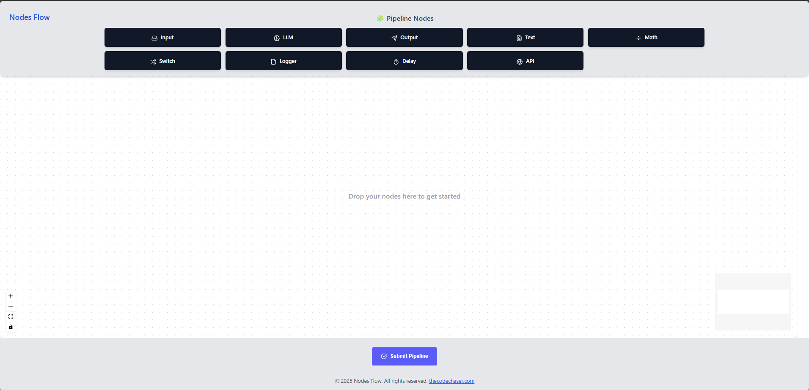
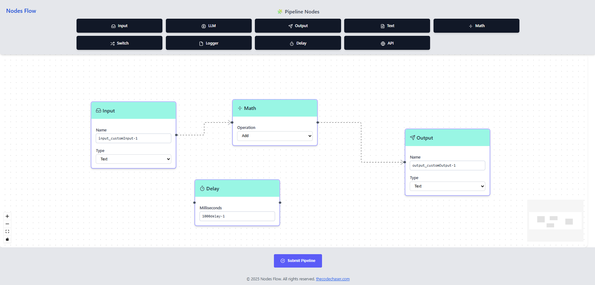
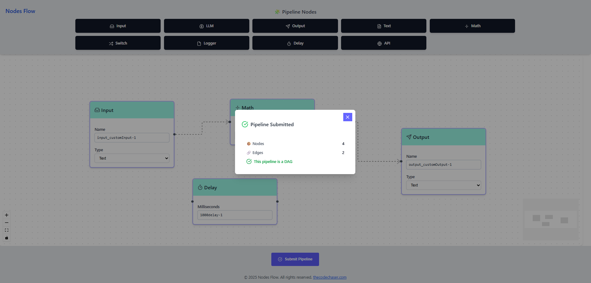

# Pipeline Flow Builder

> Pipeline Flow Builder  is a visual editor that allows users to construct custom data processing pipelines with drag-and-drop simplicity. Each node, such as Input, Math, Delay, or Output, represents a specific function and can be connected to define the flow of logic. Users can configure each node’s parameters and visualize how data moves through the system. The tool ensures that the final pipeline forms a valid Directed Acyclic Graph (DAG), enabling safe and efficient execution of complex workflows. Whether for data manipulation or automation, Pipeline Flow Builder provides a clear and flexible way to design sequential processes.

## Preview:







## Built With

- HTML
- CSS
- JavaScript
- React
- React Flow
- Tailwind CSS

## Live version

[Pipeline Flow Builder](https://pipeline-flow.thecodechaser.com)

## Getting Started

To get a local copy up and running follow these simple example steps.

### Prerequisites
- A text editor(preferably Visual Studio Code)
- Node
- Web browser

### Install
- [Git](https://git-scm.com/downloads)
- [Node](https://nodejs.org/en/download/)

### Using it Locally

- Clone the project

```bash 
git clone git@github.com:thecodechaser/pipeline-flow-builder.git

cd pipeline-flow-builder
```

- Install dependencies

```bash
npm i 
or
npm install
```
- To Start the development server
```bash
npm run start
```

- To test the project
```bash
npm run test
```


## Visit And Open Files

[Visit Repo](https://github.com/thecodechaser/pipeline-flow-builder)

## Download Repo

[Download Repo](https://github.com/thecodechaser/pipeline-flow-builder/archive/refs/heads/main.zip)

## Authors

👤 **Ranjeet Singh**

- Website: [thecodechaser.com](https://thecodechaser.com)
- GitHub: [@thecodechaser](https://github.com/thecodechaser)
- Twitter: [@thecodechaser](https://twitter.com/thecodechaser)
- LinkedIn: [thecodechaser](https://linkedin.com/in/thecodechaser)

## 🤝 Contributing

Contributions, issues, and feature requests are welcome!

Feel free to check the [issues page](https://github.com/thecodechaser/pipeline-flow-builder/issues).

## Show your support

Give a ⭐️ if you like this project!

## Acknowledgments

- Inspiration: ReactFlow

## 📝 License

This project is [MIT](./LICENSE) licensed.
